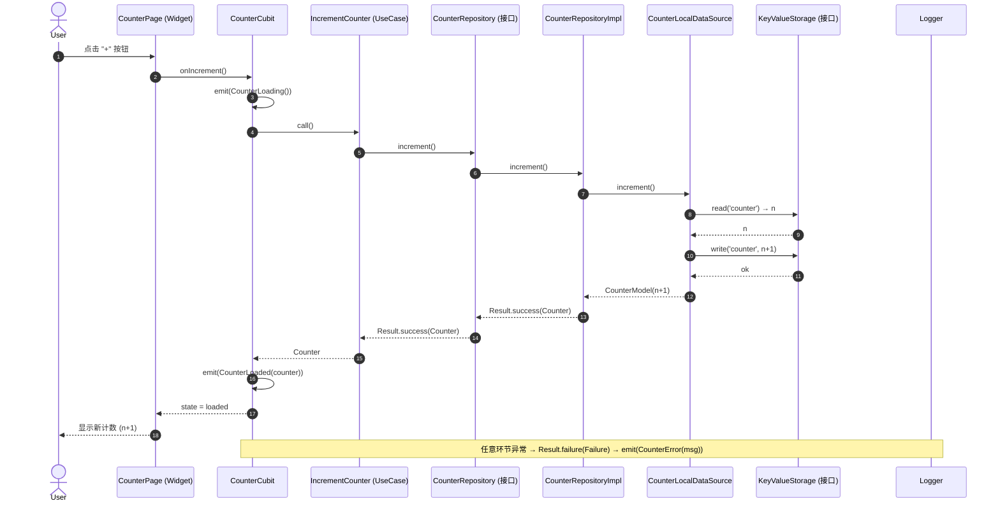

# 可复用跨平台 Flutter 应用模板 — 架构设计文档

> 文档定位：本文件是**工程模板**的架构设计，目标是「未来基于此开发很多 app」。
> 一套 Dart 代码覆盖 7 个平台：**iOS / Android / HarmonyOS(鸿蒙) / Windows / macOS / Linux / Web**。
> 本文档**只描述设计与约定**，不产出应用业务源码（源码由工程师按本文档实现）。

---

## 1. 概述与目标

| 项 | 内容 |
|----|------|
| 模板用途 | 可复用的 App Shell，新建业务 app 时 `git clone` / 复制后改 feature 即可 |
| 技术栈 | **Flutter（官方稳定）+ Flutter-OH（鸿蒙适配版 Flutter）** |
| 覆盖平台 | iOS、Android、Web、Windows、macOS、Linux（Flutter 官方）；HarmonyOS（Flutter-OH） |
| 架构风格 | Clean Architecture 变体（feature 分层 + core 平台无关层） |
| 状态管理 | **flutter_bloc（以 Cubit 为主）** |
| 依赖注入 | **get_it** 单例容器，在 `bootstrap` 阶段装配 |
| 核心诉求 | 成熟开源方案、端到端完整、强可测试性、模式可复制 |

### 1.1 平台能力现状（关键约束）

- 6 个平台（iOS/Android/Web/Windows/macOS/Linux）由**官方 Flutter** 稳定支持，`flutter create --platforms=...` 直接生成原生目录。
- **HarmonyOS 不在官方 Flutter 之内**。需使用 **Flutter-OH SDK**（社区/开放原子维护的鸿蒙适配版），其命令为 `flutter create --platforms ohos` 与 `flutter build hap`。
- 因此模板必须做到：**业务代码与平台生成目录解耦**；鸿蒙构建通过一个独立的 bootstrap 步骤 + 独立 SDK 环境完成，不污染 6 平台的标准流程。

---

## 2. 目录树（带用途注释）

```
app_template/                                  # 模板工程根目录（用户以此为基础建新 app）
├── README.md                                  # 模板使用说明（如何 bootstrap / 跑测试 / 构建各平台）
├── pubspec.yaml                               # 依赖声明（用户执行 `flutter pub get`）
├── analysis_options.yaml                      # flutter_lints（+ 可选 very_good_analysis）规则
├── bootstrap.dart                             # bootstrap 脚本：生成 6 平台原生目录 + ohos 指引
├── .gitignore
├── l10n.yaml                                  # flutter gen-l10n 配置
├── .github/
│   └── workflows/
│       ├── ci.yml                             # GitHub Actions：analyze + test + 多平台 build
│       └── release.yml                        # 触发 Fastlane 发布（tag / 手动）
├── fastlane/                                  # 多平台发布自动化
│   ├── Fastfile                               # iOS / Android / ... 发布 lanes
│   ├── Appfile
│   └── README.md
├── lib/                                       # ===== 全部 Dart 源码（平台无关为主）=====
│   ├── main.dart                              # 应用入口：runApp(MyApp()) + bootstrap()
│   ├── app/                                   # 应用级装配
│   │   ├── app.dart                           # MyApp：MaterialApp / 主题 / 路由 / l10n
│   │   ├── bootstrap.dart                     # 初始化：日志 / 环境 / DI 装配（await）
│   │   └── environment.dart                   # 环境枚举（dev / staging / prod）+ 注入
│   ├── core/                                  # ===== 纯 Dart、平台无关、100% 可测 =====
│   │   ├── errors/
│   │   │   ├── failures.dart                  # Failure 抽象 + 具体失败（Server/Network/Cache...）
│   │   │   └── exceptions.dart                # Exception 定义（用于抛出的底层异常）
│   │   ├── utils/
│   │   │   ├── result.dart                    # Result<S, F> 函数式结果类型（或 Either 封装）
│   │   │   ├── logger.dart                    # Logger 接口 + 默认实现（包裹 logger 包）
│   │   │   └── extensions.dart                # 通用扩展（String/DateTime/...）
│   │   ├── network/
│   │   │   ├── http_client.dart               # HttpClient 抽象接口（request/get/post...）
│   │   │   └── dio_http_client.dart           # 基于 dio 的实现（注入 Dio 实例）
│   │   ├── storage/
│   │   │   └── key_value_storage.dart         # 键值存储抽象接口（get/set/remove/clear）
│   │   ├── config/
│   │   │   └── app_config.dart                # 环境配置：apiBaseUrl、超时、开关等
│   │   ├── usecases/
│   │   │   └── usecase.dart                   # UseCase 基类（Future<Result<T, Failure>> call()）
│   │   └── platform/
│   │       ├── app_platform.dart              # AppPlatform 枚举：android/ios/web/windows/macos/linux/ohos
│   │       └── platform_info.dart             # PlatformInfo 解析（含 oh蒙 MethodChannel 占位）
│   ├── features/                              # ===== 业务功能（每个 feature 自包含）=====
│   │   └── counter/                           # 示例 feature（演示完整模式，业务极简）
│   │       ├── domain/
│   │       │   ├── entities/
│   │       │   │   └── counter.dart           # Counter 实体（值对象）
│   │       │   ├── repositories/
│   │       │   │   └── counter_repository.dart# CounterRepository 抽象接口
│   │       │   └── usecases/
│   │       │       ├── get_counter.dart       # 取计数 UseCase
│   │       │       └── increment_counter.dart # 自增 UseCase
│   │       ├── data/
│   │       │   ├── models/
│   │       │   │   └── counter_model.dart     # CounterModel（fromJson/toJson，映射实体）
│   │       │   ├── repositories/
│   │       │   │   └── counter_repository_impl.dart # 实现抽象接口
│   │       │   └── datasources/
│   │       │       └── counter_local_datasource.dart # 本地数据源（读写 KeyValueStorage）
│   │       └── presentation/
│   │           ├── pages/
│   │           │   └── counter_page.dart      # CounterPage（BlocProvider + 消费 Cubit）
│   │           ├── widgets/
│   │           │   └── counter_display.dart   # 展示用通用 widget
│   │           └── state/
│   │               ├── counter_state.dart     # CounterState（initial/loading/loaded/error）
│   │               └── counter_cubit.dart     # CounterCubit（emit state，调用 usecase）
│   ├── shared/                                # ===== 跨 feature 共享 =====
│   │   ├── theme/
│   │   │   └── app_theme.dart                # 亮/暗主题、Typography、ColorScheme
│   │   ├── l10n/
│   │   │   ├── app_en.arb                    # 英文文案
│   │   │   └── app_zh.arb                    # 中文文案
│   │   └── widgets/
│   │       ├── app_error.dart                # 通用错误展示
│   │       └── app_loading.dart              # 通用加载展示
│   ├── di/
│   │   └── injection_container.dart          # get_it 装配（所有依赖注册 + 初始化顺序）
│   └── platforms/                             # ===== per-platform 实现隔离（可选分层）=====
│       ├── storage/
│       │   └── shared_preferences_storage.dart# KeyValueStorage 的 shared_preferences 实现
│       └── platform_info/
│           └── platform_info_impl.dart       # PlatformInfo 的具体解析（web/ohos 特殊处理）
├── test/                                      # 单元测试（core 纯逻辑 + usecase + cubit）
├── test_features/                             # Widget 测试（presentation）
├── integration_test/                          # 集成测试 + patrol 用例
└── tools/                                     # 辅助脚本（版本号、环境切换等，可选）
```

> 说明：文档中列出 `lib/` 等是为给出**完整约定**。按团队要求，本阶段**只编写本文档与 TASKS.md**，不直接创建上述源码文件（那是工程师的工作）。

---

## 3. 分层与 Clean Architecture 映射

| 层 | 目录 | 依赖方向 | 平台相关性 | 可测性 |
|----|------|----------|-----------|--------|
| 表现层 | `features/*/presentation` | 依赖 domain（usecase） | 依赖 Flutter（Widget） | Widget 测试 |
| 领域层 | `features/*/domain` | 不依赖任何外层 | 纯 Dart | 单元测试（最快） |
| 数据层 | `features/*/data` | 依赖 domain 接口 | 纯 Dart（依赖 core 抽象） | 单元测试（mock datasource） |
| 核心层 | `core/` | 不依赖 feature | 纯 Dart（platform 层仅抽象） | 单元测试 100% |
| 共享层 | `shared/` | 不依赖 feature 业务 | 依赖 Flutter | Widget 测试 |
| 装配层 | `di/` + `app/` | 依赖全部 | 运行时装配 | 轻量 |

**依赖铁律**：内层不知道外层；`domain` 只定义**抽象** repository，`data` 提供**实现**。任何跨层调用都经由抽象接口，便于 mock 测试。

---

## 4. 状态管理选型

**选型：`flutter_bloc`（以 Cubit 为主，复杂异步流再上 Bloc）。**

| 候选 | 结论 | 理由 |
|------|------|------|
| `flutter_bloc` (Cubit) | ✅ 采用 | 可测性最强：`bloc_test` 可在**无 BuildContext**下纯逻辑测试；state 不可变、可比较；事件/状态显式化 |
| `provider` + `ChangeNotifier` | ❌ | 测试需 rebuild，notifyListeners 难断言；大型项目易混乱 |
| `riverpod` | ⚠️ 备选 | 很强，但模板需兼顾「最少学习曲线 + 与 get_it DI 协作」；bloc 与 usecase 的「输入→输出」模型更贴合 clean architecture |
| `getX` | ❌ | 反模式集中、可测性弱、不利于模板规范 |

**Cubit 约定**：
- 每个 feature 的 `state` 用 `freezed` 或手写不可变类，含 `initial / loading / loaded / error` 四态（模板统一约定）。
- Cubit 只做**状态编排**，不写业务规则；业务规则下沉到 usecase。
- Cubit 构造函数注入 usecase：`CounterCubit({required GetCounter g, required IncrementCounter i})`。

---

## 5. 数据 / 控制流时序图

以「counter 自增」为例，展示完整链路（UI → Cubit → UseCase → Repository 接口 → Data 实现 → 数据源 → 回传 State）：



**错误回传约定**：数据源抛 `Exception` → data 层 catch 后转 `Failure` → usecase 返回 `Result.failure` → Cubit `emit(CounterError)`。UI 永远只消费 `state`，不直接感知异常类型。

---

## 6. 依赖注入约定（get_it）

- 使用 **get_it** 作为编译期无关的单例容器（避免 `injectable` 代码生成对模板初学者的额外负担；如团队偏好可升级到 injectable）。
- 所有注册集中在 `lib/di/injection_container.dart` 的 `Future<void> initDi() async`：
  1. 先注册**核心单例**：`AppConfig`、`Logger`、`KeyValueStorage`（实现）、`HttpClient`（注入 Dio）、`PlatformInfo`。
  2. 再注册 **feature 数据层**：datasource → repository 实现（依赖上面的 core）。
  3. 最后注册 **usecase** 与 **cubit**（依赖 repository）。
- `lib/app/bootstrap.dart` 中 `await initDi()` 后 `runApp`。
- 注册风格统一：`sl.registerLazySingleton<X>(() => XImpl(...))`；需要异步初始化的（如 `SharedPreferences`）用 `await sl.isReady<X>()`。

```dart
// 示例（工程师实现时参考）
final sl = GetIt.instance;
Future<void> initDi() async {
  // core
  sl.registerLazySingleton<Logger>(() => DefaultLogger());
  final prefs = await SharedPreferences.getInstance();
  sl.registerLazySingleton<KeyValueStorage>(() => SharedPreferencesStorage(prefs));
  sl.registerLazySingleton<HttpClient>(() => DioHttpClient(Dio(BaseOptions(
    baseUrl: sl<AppConfig>().apiBaseUrl,
  ))));
  sl.registerLazySingleton<PlatformInfo>(() => PlatformInfoImpl());
  // feature: counter
  sl.registerLazySingleton<CounterLocalDataSource>(() => CounterLocalDataSourceImpl(sl()));
  sl.registerLazySingleton<CounterRepository>(() => CounterRepositoryImpl(sl()));
  sl.registerLazySingleton(() => GetCounter(sl()));
  sl.registerLazySingleton(() => IncrementCounter(sl()));
  sl.registerFactory(() => CounterCubit(getCounter: sl(), incrementCounter: sl()));
}
```

---

## 7. 跨平台适配策略

| 逻辑类别 | 放置位置 | 说明 |
|----------|----------|------|
| 业务规则 / usecase | `core` + `features/domain` | 100% 共享，平台无关 |
| 网络 / 存储 / 配置 / 错误 / 日志 | `core`（**仅接口**） | 接口共享，实现隔离 |
| 平台能力实现（storage、platform_info、push、share、相机…） | `core/*` 定义接口；具体实现放 `lib/platforms/*` 或平台 `method_channel` | 通过 DI 注入，业务层无感知 |
| UI / 主题 / l10n | `shared` + `features/presentation` | Flutter 单码跨 7 平台；鸿蒙 UI 也走 Flutter widget 树 |
| 原生壳工程（iOS/Android/ohos/... 目录） | 由 `flutter create` / `flutter build hap` 生成 | **不进版本库核心**，仅保留配置（如 `Info.plist` 片段、`ohos/` 配置模板） |

**原则**：业务代码「一次编写，七端运行」；任何平台差异通过**抽象接口 + per-platform 实现**隔离，绝不在 feature 里写 `if (Platform.isX)`。

---

## 8. 平台能力抽象（含鸿蒙检测）

Flutter 官方 `defaultTargetPlatform` 枚举为：`android / fuchsia / iOS / linux / macOS / windows / web` —— **不含 `ohos`**。

因此模板自定义 `AppPlatform` 枚举并自行解析：

```dart
// lib/core/platform/app_platform.dart
enum AppPlatform { android, ios, web, windows, macOS, linux, ohos }

// lib/core/platform/platform_info.dart
abstract class PlatformInfo {
  AppPlatform get current;     // 当前平台
  bool get isMobile;           // android || ios || ohos
  bool get isDesktop;          // windows || macOS || linux
  bool get isWeb;
  bool get isOhos;
}
```

**鸿蒙解析方案（可扩展占位）**：
- 非 web 且 `!kIsWeb` 时，优先尝试通过 **MethodChannel**（`channel.invokeMethod<bool>('is_ohos')`）向鸿蒙原生侧询问；若返回 `true` 则判定为 `ohos`。
- 兜底：`defaultTargetPlatform` 映射其余 6 平台。
- 该通道在 ohos 原生侧由 Flutter-OH 工程补充，模板仅保留**接口与方法调用占位**，保证 6 平台下编译通过（channel invoke 在 6 平台返回 false / 抛可控异常）。

```dart
// 伪代码（工程师实现参考）
const _channel = MethodChannel('app_template/platform');
AppPlatform resolve() {
  if (kIsWeb) return AppPlatform.web;
  try {
    // 仅在鸿蒙原生侧实现该方法；其它平台未实现 → 视为非 ohos
    final bool isOhos = /* platform channel 调用，带 try/catch 兜底 false */ false;
    if (isOhos) return AppPlatform.ohos;
  } catch (_) { /* ignore */ }
  switch (defaultTargetPlatform) {
    case TargetPlatform.android: return AppPlatform.android;
    case TargetPlatform.iOS: return AppPlatform.ios;
    case TargetPlatform.windows: return AppPlatform.windows;
    case TargetPlatform.macOS: return AppPlatform.macOS;
    case TargetPlatform.linux: return AppPlatform.linux;
    default: return AppPlatform.android;
  }
}
```

---

## 9. 错误处理与结果类型

统一采用 **`Result` / `Either<Failure, Success>`** 模式，区分「可恢复的域错误（Failure）」与「程序异常（Exception）」：

| 概念 | 用途 | 抛出/返回位置 |
|------|------|---------------|
| `Exception`（底层） | 网络超时、JSON 解析失败等**底层意外** | data / datasource 内部 `throw` |
| `Failure`（域错误） | 业务可解释错误（ServerFailure/NetworkFailure/CacheFailure） | data 层 catch Exception 后**转换**为 Failure，经 `Result.failure` 上抛 |
| `Result<S, F>` | usecase 的返回类型，强制调用方处理成功/失败 | usecase → cubit |

`core/utils/result.dart` 提供一个轻量封装（推荐自实现以避免 `dartz` 的 FP 心智负担；若团队熟悉 FP 可改引 `dartz` / `either_dart`）：

```dart
sealed class Result<S, F> {
  const Result();
  factory Result.success(S value) = Success<S, F>;
  factory Result.failure(F failure) = FailureResult<S, F>;
}
final class Success<S, F> extends Result<S, F> { final S value; ... }
final class FailureResult<S, F> extends Result<S, F> { final F failure; ... }
```

**UseCase 基类**：

```dart
abstract class UseCase<Type, Params> {
  Future<Result<Type, Failure>> call(Params params);
}
```

---

## 10. 测试分层策略

| 层级 | 目录 | 工具 | 覆盖对象 | 运行命令 |
|------|------|------|----------|----------|
| 单元测试 | `test/` | `test` + `mocktail` + `bloc_test` | core 纯逻辑、usecase、cubit、model 映射 | `flutter test` |
| Widget 测试 | `test_features/` | `flutter_test`（WidgetTester）+ `mocktail` | presentation（page/widget 与 cubit 交互） | `flutter test test_features` |
| 集成测试 | `integration_test/` | `integration_test`（SDK）+ `patrol` | 真机/模拟器端到端用户流 | `flutter test integration_test` / `patrol test` |

**要点**：
- core 必须 **100% 可测**，不依赖 `dart:io` / `dart:html` / `flutter` 以外的平台 API。
- usecase / cubit 测试用 `mocktail` mock repository 接口，验证「给定输入 → 发出预期 state / 返回预期 Result」。
- `patrol` 用于需要系统交互的端到端（权限弹窗、深链、系统分享）。`patrol_cli` 通过 `dart pub global activate patrol_cli` 安装，不在 `pubspec` 内。
- 所有测试在 **CI 中强制通过** 才允许合并 / 发布。

---

## 11. CI / Fastlane 发布管线

### 11.1 GitHub Actions（`.github/workflows/ci.yml`）
- **触发**：push 到 `main`、PR、以及 `release.yml` 的 tag。
- **步骤**：
  1. 复用 `subosito/flutter-action`（官方 Flutter 版本）。
  2. `flutter pub get`。
  3. `dart analyze`（严格，0 warning 才过）。
  4. `flutter test`（单元 + Widget）。
  5. `flutter test integration_test`（可选矩阵，仅 macOS runner 跑桌面/移动模拟器）。
  6. 各平台 build 校验（web 用 `flutter build web`；其余按需 `flutter build apk/aab/ios --no-codesign` 等，仅验证可编译）。
- **鸿蒙**：CI 标准 runner 无 Flutter-OH，故 ohos 构建**不在公共 CI 跑**，仅在带 Flutter-OH SDK 的自托管 runner（label `ohos`）或本地执行。

### 11.2 Fastlane（`fastlane/Fastfile`）
- 按平台分 lane：**`android`**（build aab + 上传 Play 内部轨道）、**`ios`**（build + 上传 TestFlight）、`macos` / `windows` / `linux` 作为桌面分发包 lane（DMG / EXE / AppImage）。
- 鸿蒙 lane（注释/占位）：`flutter build hap` 后用 DevEco / 命令行工具签名分发（具体命令随 Flutter-OH 版本演进，模板给出占位与文档链接）。
- 凭据经 GitHub Secrets / `.env`（不入库）注入。

---

## 12. 关键设计决策与理由（汇总表）

| # | 决策 | 选择 | 理由 |
|---|------|------|------|
| D1 | 架构 | Clean Architecture 变体 | 可测试、可替换、feature 解耦，适合「反复造 app」 |
| D2 | 状态管理 | flutter_bloc（Cubit 为主） | 可测性最强，与 usecase 模型契合 |
| D3 | DI | get_it 手动装配 | 零代码生成、易上手、运行时可控顺序 |
| D4 | 错误模型 | Result<Type, Failure>（success-first）+ Exception→Failure 转换 | 编译期强制处理失败，UI 只消费 state |
| D5 | 网络 | dio + HttpClient 抽象 | dio 成熟；抽象后便于 mock 与替换 |
| D6 | 存储 | KeyValueStorage 接口 + shared_preferences 实现 | 接口共享，实现可换（secure_storage 等） |
| D7 | 鸿蒙 | Flutter-OH + MethodChannel 平台识别 | 官方不支持，需独立 SDK 与可扩展解析 |
| D8 | 平台目录 | 生成物不入库，仅留配置模板 | 保持仓库干净、bootstrap 可重建 |
| D9 | 测试 | 三层 + patrol | 覆盖单元/Widget/端到端，CI 门禁 |
| D10 | 代码规范 | 100 字符行宽 + flutter_lints + very_good_analysis | 统一风格、减少 review 成本 |

---

## 13. 待明确事项（Open Questions）

1. **Flutter-OH 版本与命令稳定性**：`flutter build hap` 的参数随 Flutter-OH 演进可能变化，模板发布管线需按当时 SDK 文档微调（建议在 `README` 标注 SDK 兼容版本）。
2. **是否引入 `freezed`**：state / model 的不可变与 `fromJson` 可用 `freezed` 自动生成；模板默认手写以降低依赖，若团队接受代码生成可在 TASKS 中升级。
3. **l10n 方案**：默认 `flutter gen-l10n`（无需额外包）；如需要复数/性别的高级能力可换 `intl` + `easy_localization`，待确认。
4. **推送 / 分享 / 深链**等平台能力的抽象接口：本模板在 `core/platform` 仅给出 `PlatformInfo` 与 `KeyValueStorage` 示范，其余（push/share）在后续 feature 需要时按同样「接口 + per-platform 实现」模式扩展。
5. **状态持久化**：counter 用本地存储示范；是否需要全局持久化/加密存储（`flutter_secure_storage`）作为模板标配，待定。

---

> 本文件结束。配套任务分解见 `TASKS.md`。
